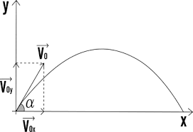

# Lancio di un proiettile

Utilizzando le formule che descrivono la traiettoria di un proiettile dato l'angolo α e la velocità iniziale v0, stampare la posizione del proiettile in termini delle sue coordinate *x* e *y*, da quando parte a quando tocca terra, a intervalli di 0.1 secondi. Si supponga che il punto di lancio si trovi nelle coordinate 0,0 del sistema di riferimento e che sia posizionato a terra (quindi h0 = 0).

Si ricorda che lungo l'asse parallelo al piano di lancio la velocità è costante, mentre lungo l'asse perpendicolare il moto è uniformemente accelerato con accelerazione *-g*.
La formula che interessa del moto uniformemente accelerato è: 

- *h(t) = h0 + v0t - ½gt2*, con *h* altezza del proiettile da terra.

Si ricorda infine che la velocità iniziale v0 deve essere scomposta nelle due componenti, parallela e perpendicolare al terreno, utilizzando le note relazioni che utilizzano il *seno* e il *coseno*.
